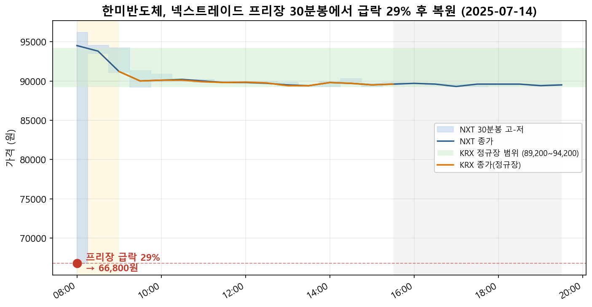
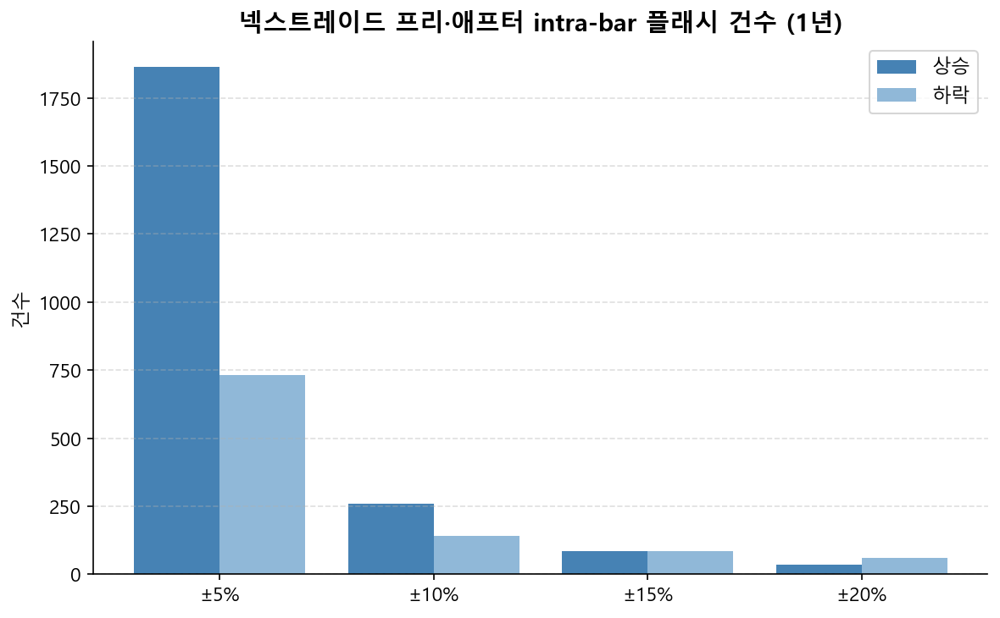
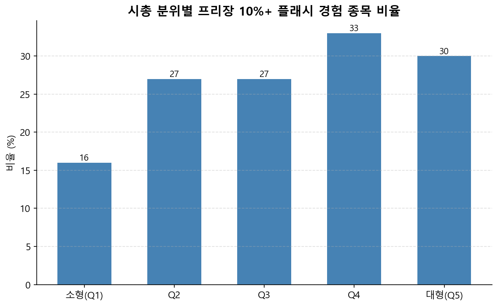
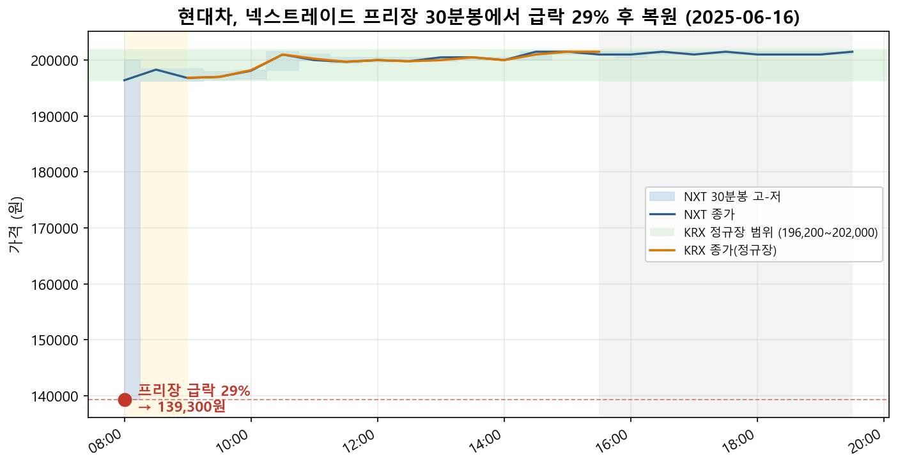
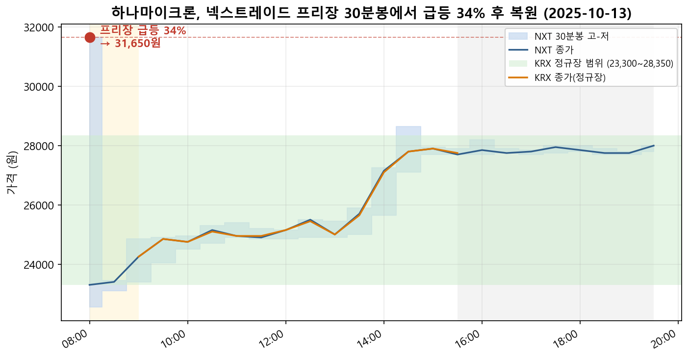

# 한미반도체가 새벽에 29% 빠졌다가 돌아왔습니다 — 넥스트레이드 프리장의 '플래시'를 데이터로 봤습니다

2025년 3월, 한국 증시에 조용하지만 큰 변화가 있었습니다. **한국거래소(KRX) 말고도 주식을 사고팔 수 있는 또 다른 장터, 넥스트레이드(NXT)가 문을 연 것**입니다. 그리고 KRX에는 없던 것이 NXT에는 생겼습니다. 바로 **정규장 전후의 프리마켓(프리장)과 애프터마켓(애프터장)**이죠.

장 시작 전 새벽과 장 마감 후 저녁에도 거래가 된다니 편리해 보입니다. 그런데 이런 연장 시간대는 거래가 얇기 마련인데, 그러면 가격이 출렁이지 않을까요? "프리장에서 가격이 튄다"는 말이 정말인지, 한번 **원본 데이터로 직접 확인**해 보겠습니다.

위 그림이 이 글의 한 줄 요약입니다. 2025년 7월 14일 새벽, **한미반도체**가 넥스트레이드 프리장에서 한순간 **94,100원에서 66,800원으로 약 29% 급락했다가 다시 90,000원대로 복원**됐습니다. 같은 날 KRX 정규장(초록 띠)에서는 그 가격에 근처도 가지 않았는데 말이죠. 이게 어떻게 된 일인지 들어가 보겠습니다.

## 프리장·애프터장이 뭔가요?

생소한 용어일 수 있지만, 쉽게 말해 **정규 거래시간(오전 9시~오후 3시 반) 앞뒤로 열리는 추가 거래시간**입니다. 넥스트레이드는 정규장 앞에 프리마켓(오전 8시대), 뒤에 애프터마켓(오후 늦게까지)을 운영합니다. 기존 한국거래소에는 이런 연장 세션이 없어서, **프리·애프터 거래는 오직 넥스트레이드에서만** 일어납니다.

문제는 이 시간대의 **유동성(사고파는 주문의 두께)**입니다. 정규장에는 수많은 주문이 빽빽하게 쌓여 있어 누군가 크게 사거나 팔아도 가격이 잘 안 흔들립니다. 반면 거래가 얇은 프리장에서는 주문 하나가 가격을 크게 밀어 올리거나 끌어내릴 수 있죠. 이게 "튄다"의 정체일 텐데, 진짜 그런지 봐야겠습니다.

## 데이터를 어떻게 잡았나

먼저 기준부터 분명히 하겠습니다.

- **데이터**: LSEG에서 넥스트레이드(`.KNT`) 종목의 **30분봉**(시가·고가·저가·종가·거래량)을 받았습니다.
- **기간**: 2025년 6월 2일 ~ 2026년 5월 29일 (30분봉 인트라데이가 제공되는 약 1년 구간). 넥스트레이드 종목 **993개 전수**.
- **'튐'의 정의 — intra-bar 플래시**: 외부 기준(예: 정규장 가격)과 비교하지 않고, **30분봉 한 개의 모양만으로** 잡았습니다. 한 봉 안에서 **고가 또는 저가가 몸통(시가~종가) 밖으로 얼마나 벗어났다가 되돌아왔는지**를 봅니다.

쉽게 말해, **한 30분 안에서 가격이 확 튀었다가 제자리로 돌아온 폭**입니다. 예를 들어 시가·종가가 비슷한데 그 사이 저가가 30% 아래로 찍혔다면, 그 30분 안에 급락했다가 복원된 것이죠. 이렇게 잡으면 "가격이 새 가격대로 이동한 것(방향성 급락·급등)"이나 "액면분할 같은 기업행위"는 자연히 걸러지고, **순수하게 튀었다 돌아온 사건**만 남습니다.

## 1년간 몇 번이나 튀었을까

993개 종목, 약 1년치 30분봉을 전수로 훑어 프리·애프터 세션의 플래시를 세어 봤습니다.

| 튐 크기 | 전체 | 상승 | 하락 | 프리장 | 애프터장 |
|---|---|---|---|---|---|
| ±5% 이상 | 2,595건 | 1,864 | 731 | 2,001 | 594 |
| **±10% 이상** | **401건** | 260 | 141 | 332 | 69 |
| ±15% 이상 | 169건 | 84 | 85 | 159 | 10 |
| ±20% 이상 | 95건 | 34 | 61 | 92 | 3 |

숫자가 적지 않습니다. **5% 넘게 튀었다 돌아온 경우가 1년에 2,595건, 10% 이상도 401건**입니다. 그림과 표에서 두 가지가 눈에 띕니다. 첫째, **압도적으로 프리장**입니다. 10% 이상 플래시의 83%(332/401)가 새벽 프리장에서 나왔습니다. 둘째, **중간 크기(±5~10%)는 상승 쪽이 많지만, 20%를 넘어가는 극단적인 경우는 하락(급락)이 더 많습니다**(하락 61건 vs 상승 34건). 가장 극적인 장면은 역시 '새벽의 급락'인 셈이죠.

## 소형주만의 문제일까? — 의외의 결과

흔히 "유동성 낮은 잡주에서나 일어나는 일"이라고 생각하기 쉽습니다. 그래서 종목을 **시가총액 5분위**로 나눠, 각 구간에서 프리장 10%+ 플래시를 한 번이라도 겪은 종목의 비율을 봤습니다.

의외의 결과가 나왔습니다. **가장 작은 소형주(16%)가 오히려 가장 낮고, 중·대형주(Q4 33%, 대형 30%)에서 더 자주** 관측됐습니다. 왜 그럴까요? 플래시는 **프리장에서 실제 체결이 일어나야 기록**됩니다. 초소형주는 새벽에 거래 자체가 거의 없어 사건이 잡힐 기회가 적은 반면, 이름 있는 중·대형주는 프리장에도 사람이 몰려 그만큼 튈 기회도 많은 것으로 보입니다. 어느 쪽이든 결론은 분명합니다. **프리장 플래시는 소형주만의 이야기가 아닙니다.** 실제로 1년간 **993개 중 264개 종목**이 프리장에서 10% 이상 플래시를 한 번 이상 겪었습니다.

## 그런데 정말 '튄 것'이 맞나요? — KRX와 대조

여기서 한 가지 의심이 듭니다. 그 새벽의 극단가가 진짜 일시적 출렁임일까요, 아니면 그날 그 종목에 무슨 큰일이 있었던 걸까요? 이걸 가르려고 **같은 날 한국거래소(KRX) 정규장**과 대조했습니다. KRX에는 프리·애프터가 없으니, **프리장에서 찍힌 극단가가 그날 KRX 정규장 거래 범위 안에 있었는지**만 보면 됩니다. 범위 '밖'이라면, 그 가격은 KRX에서는 일어나지 않은 **넥스트레이드 연장세션에서만 벌어진 일**이라는 뜻이죠.

10% 이상 플래시 케이스를 KRX와 맞춰본 결과, **399건 중 386건(97%)에서 넥스트레이드 극단가가 KRX 당일 정규장 범위 밖**이었습니다. 거의 전부가 'NXT 전용 현상'이었던 것입니다. 개별 사례로 내려가 보겠습니다.

### 한미반도체 — 새벽에 29% 급락

다시 첫 그림입니다. 2025년 7월 14일, 한미반도체는 프리장 첫 30분봉에서 시가 94,100원으로 출발해 **저가 66,800원(−29%)**을 찍고는 종가 94,500원으로 거의 원위치했습니다. 같은 날 **KRX 정규장의 가격은 하루 종일 89,200~94,200원**(초록 띠)에 머물렀습니다. 66,800원은 KRX에서는 단 한 번도 나오지 않은 가격이죠. 유동성 상위 종목조차 새벽 한순간 이런 일이 벌어진다는 점이 인상적입니다.

### 현대차 — 대형주도 예외가 아닙니다

대형주 중의 대형주, **현대차**도 비껴가지 않았습니다. 2025년 6월 16일 프리장에서 **139,300원(−29%)**까지 순간 급락했는데, 같은 날 KRX 정규장은 종일 **196,200~202,000원**에서 안정적으로 거래됐습니다. 그림에서 빨간 점(프리장 극단가)이 초록 띠(KRX 범위) 한참 아래에 외따로 떨어져 있는 게 보이시죠. **프리장 플래시가 대형주에서도 나타난다**는 걸 한 장으로 보여주는 장면입니다.

### 하나마이크론 — 위로도 튑니다

방향이 늘 아래인 것은 아닙니다. **하나마이크론**은 2025년 10월 13일 프리장에서 거꾸로 **31,650원(+33%)**까지 솟구쳤다가 23,000원대로 내려왔습니다. 이날 KRX 정규장 범위는 23,300~28,350원이었으니, 31,650원 역시 KRX에는 없던 가격입니다. 새벽에는 위아래 양쪽으로 다 튄다는 것을 보여줍니다.

## 데이터가 말해주는 것

지금까지 본 것을 정리하면 이렇습니다.

- 넥스트레이드 프리·애프터장에서 **한 30분봉 안에 튀었다 돌아온 플래시가 1년간 5% 이상 2,595건, 10% 이상 401건** 관측됐습니다.
- 그 대부분(10%+의 83%)이 **새벽 프리장**에서, 가장 극단적인 경우는 **급락** 쪽에서 나왔습니다.
- 이는 **소형주만의 문제가 아니라** 한미반도체·현대차 같은 **중·대형주에서도** 나타났고, 10%+ 플래시의 **97%는 같은 날 KRX 정규장 범위 밖**의, 넥스트레이드 연장세션에서만 벌어진 일이었습니다.

물론 이 분석에는 한계가 있습니다. 30분봉의 고가·저가로 잡은 것이라 '봉 안에서 정확히 언제·몇 번 튀었는지'까지는 보지 못하고, 단일가 체결 한 건이 만든 극단가도 포함될 수 있습니다. 다만 그렇게 얇은 호가에서 가격이 크게 움직인다는 사실 자체가 **연장세션의 유동성이 정규장만큼 두텁지 않다**는 점을 보여준다고 할 수 있겠습니다.

새벽이나 저녁에 넥스트레이드에서 거래할 때, 화면에 찍히는 가격이 그 종목의 '진짜 시세'와 한참 떨어진 순간일 수 있다는 것 — 데이터는 그 가능성을 꽤 또렷하게 보여주고 있습니다.

---

*데이터: LSEG, 넥스트레이드(`.KNT`)·KRX(`.KS`/`.KQ`) 30분봉, 2025-06-02 ~ 2026-05-29, 993개 종목 전수. 집계·차트는 직접 작성한 분석 코드로 산출했습니다.*
